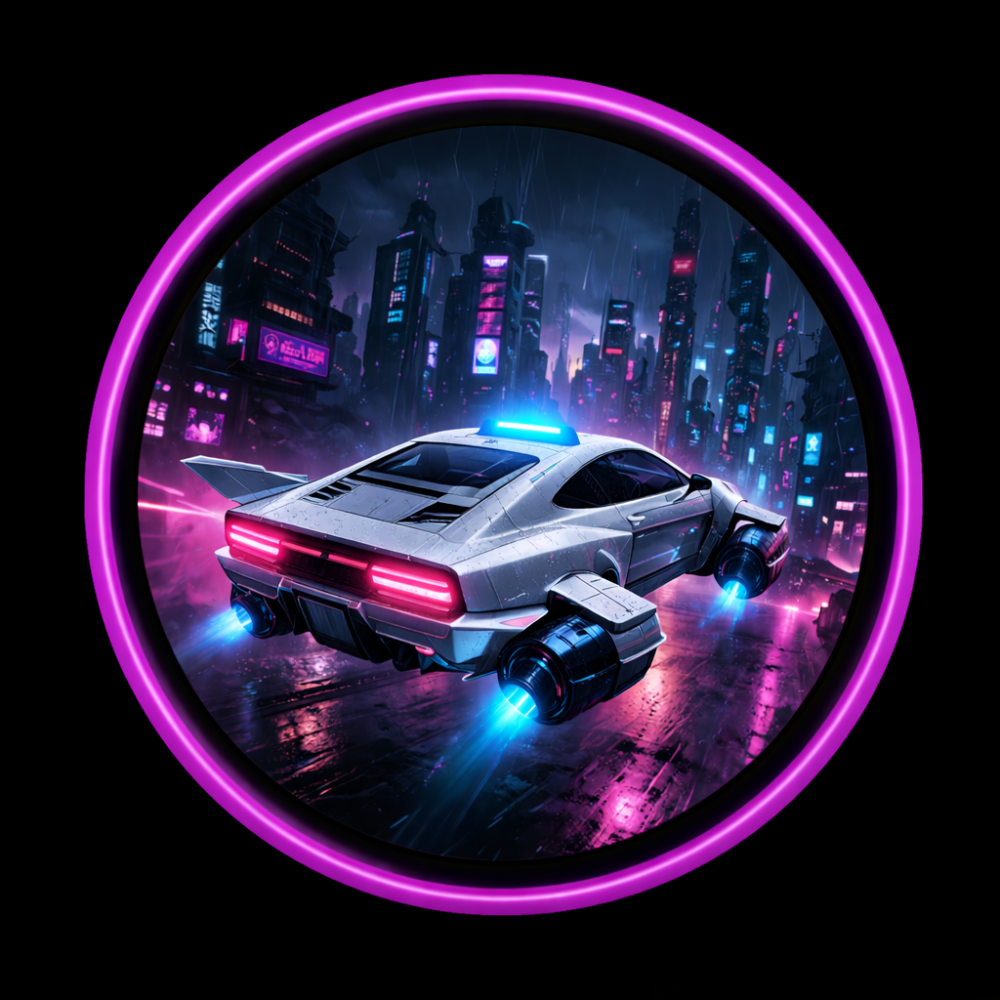

# CyberTaxi



A small arcade-style hover taxi game built with Three.js and Vite.

You pilot a futuristic cab through a neon city, choose fares, deliver passengers across districts, evade hostile rival taxis, and try to keep each run profitable long enough to escape the city.

## Features

- Third-person hover taxi driving
- Procedural neon city with different districts
- Five-choice pickup and drop-off mission loop
- Fare timer, distance-scaled pricing, and collision penalties
- Boost system with recharge
- Collidable NPC traffic
- Heat-based rival taxi pursuit system with multiple enemy behaviors
- EMP pickups and inventory for crowd control
- Energy system with rooftop recharge stations
- Pause overlay and expanded HUD with fare info, dispatch feed, navigator, heat, and EMP inventory
- Background music support with mute toggle

## Tech Stack

- `three`
- `vite`
- Plain JavaScript modules
- CSS for HUD and overlays

## Getting Started

### Requirements

- Node.js 18+ recommended
- npm

### Install

```bash
npm install
```

### Run in development

```bash
npm run dev
```

### Build for production

```bash
npm run build
```

### Preview production build

```bash
npm run preview
```

## Music Setup

If you want background music, place your mp3 here:

`public/audio/midnight_circuits_1.mp3`

The game will try to start music automatically when the game begins. Some browsers block autoplay until the first click or key press.

## Controls

- `W` / `S`: accelerate / brake
- `A` / `D`: steer
- `Q` / `E`: strafe left / right
- `J` / `K`: rise / descend
- `Space`: boost
- `L`: use EMP
- `Esc`: pause / resume
- `M`: toggle music

Arrow keys also work for forward, brake, and steering.

## Gameplay

1. Choose from the blue passenger pickup markers.
2. Fly into one pickup zone to lock in that fare.
3. Follow the pink drop-off marker.
4. Deliver the passenger before the fare drops too much.
5. Watch heat rise as you survive, earn, and complete fares.
6. Collect green EMP charges when they appear and use them if rival taxis start to swarm.

Important rules:

- Your fare value drains over time while a passenger is onboard.
- Crashes during a ride reduce the fare further.
- Crashing while boosting causes a larger penalty.
- Longer trips pay more than shorter trips.
- If a fare drops to `0`, the ride fails and you lose 50% of the original fare from your credits.
- Energy drains over time and faster while boosting.
- You must stay parked in an energy station for 5 seconds to refill.
- If energy hits `0` while carrying a passenger, you are charged a `1000` credit penalty.
- Rival taxis escalate with heat and can chase, intercept, block, ram, and swarm.
- EMP pickups spawn every 2 minutes and can be stored for later use.
- A single EMP blast can disable up to 10 nearby rival taxis.

## Project Structure

- `src/main.js`
  - App entry point
- `src/game/GameApp.js`
  - Main game bootstrap and frame loop
- `src/game/config.js`
  - Tunable gameplay and world settings
- `src/systems/CityGenerator.js`
  - District generation, buildings, signs, billboards, and traffic paths
- `src/systems/PlayerController.js`
  - Player taxi mesh, movement, hover effects, and boost behavior
- `src/systems/TrafficManager.js`
  - NPC traffic spawning and movement
- `src/systems/rivals/HeatSystem.js`
  - Rival escalation and heat tracking
- `src/systems/rivals/RivalTaxiManager.js`
  - Rival taxi pooling, spawning, roles, and update coordination
- `src/systems/rivals/RivalTaxiAgent.js`
  - Individual rival taxi steering and behavior state
- `src/systems/rivals/SpawnSystem.js`
  - Rival spawn point selection outside the player's view
- `src/systems/rivals/SteeringBehaviors.js`
  - Lightweight seek, pursue, separation, and avoidance helpers
- `src/systems/MissionSystem.js`
  - Fare generation, five-choice pickup logic, drop-off flow, and payout handling
- `src/systems/EnergySystem.js`
  - Energy drain, rooftop recharge stations, and depletion penalties
- `src/systems/EmpSystem.js`
  - EMP pickup spawning, inventory, activation, and blast effect
- `src/systems/CollisionSystem.js`
  - Building, traffic, and rival collision handling
- `src/systems/UIManager.js`
  - HUD layout, pause overlay, inventory display, and navigator updates
- `src/systems/MusicManager.js`
  - Background music playback and mute state
- `src/styles.css`
  - HUD and UI styling

## Notes

- This project currently has no backend or persistence.
- Most visuals are generated from primitive geometry rather than external art assets.
- The city look is driven by procedural emissive windows, neon accents, fog, a sky dome, and lightweight bloom rather than heavy dynamic lights.
- The game is meant to be easy to iterate on through `src/game/config.js` and the systems under `src/systems/`.

## Additional Context

For a more detailed handoff document, see:

`PROJECT_CONTEXT.md`
